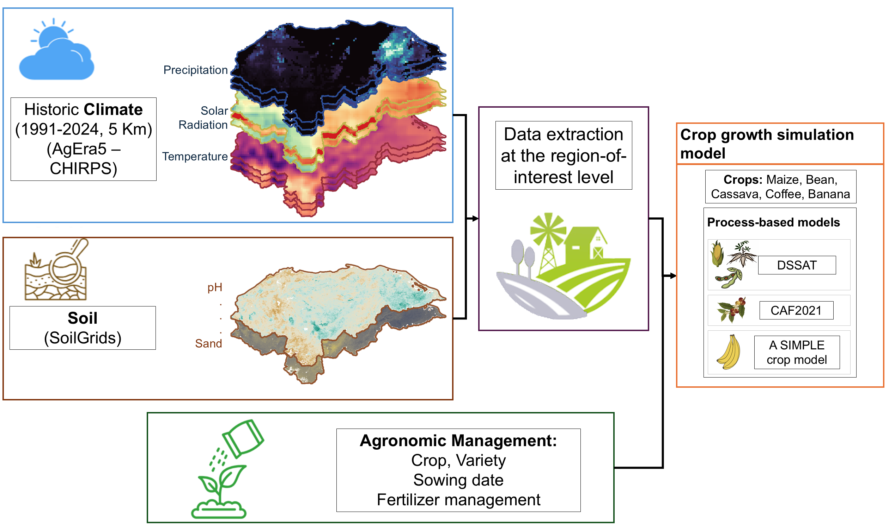

# Spatial Crop Simulation:

**WeatherSoilDataProcessor** is a Python-based tool designed to support site-specific crop growth simulation by integrating climate, soil, and management information. The repository allows users to:

* **Download and process data**: Retrieve historic climate data (precipitation, temperature, solar radiation) from AgEra5 and CHIRPS, and soil properties from SoilGrids.

* **Generate spatial data cubes**: Build multi-temporal weather datasets and multi-depth soil profiles tailored to a region of interest.

* **Incorporate agronomic management**: Define crop, variety, sowing dates, and fertilizer management to set up realistic scenarios.

* **Simulate potential yield using process-based crop models (PBCs)**: Simulate potential crop yield using process-based crop models and spatial data. Currently, two PBCs are available: 
  * [DSSAT](https://dssat.net/): A widely-used crop simulation model for various crops and farming systems.
  * [CAF2021](https://link.springer.com/article/10.1007/s10457-022-00755-6): An agroforestry model specifically designed to simulate coffee growth and its interaction with shade trees.
  * [a SIMPLE crop model](https://www.sciencedirect.com/science/article/abs/pii/S1161030118304234): a simple generic crop model,that could be easily modified for any crop to simulate development, crop growth and yield. 

* **Visualize and export results**: Produce maps, tables, and DSSAT-compatible files for scientific and agricultural research applications.

<p align="center">
  
  <br>
  <em>Figure 1. Workflow of the WeatherSoilDataProcessor repository</em>
</p>

## Installation

* Python 3.7+
* pip install -r requirements.txt


## How to Use

### Example: Download Weather data from AgEra5 and Chirps
This script downloads weather data based on the configuration provided in a YAML file. The downloaded data will be saved in a specified folder and can be exported in various formats like NetCDF.
```bash
python download_weather_data.py --config options/weather_data_downloading_config.yaml
```
Here’s an example of what your generate_dssat_files_per_aoi_and_group.yaml file should include:
```yaml

DATES:
  starting_date: "2001-01-01"
  ending_date: "2001-12-31"

GENERAL:
  suffix: '_weather_data' # if the output weather folder has any suffix
  export_netcdf: True

SPATIAL_INFO:
  spatial_file: 'data/country.shp' # if the shapefile is not provided the spatial extent in WGS84 can be used
  extent: [-90, 12, -83, 17] ## [xmin, ymin, xmax, ymax] for the spatial extent

PATHS:
  output_path: "path/to/output_directory"

WEATHER:
  variables:
    precipitation:
      mission: chirps 
      source: chips

    solar_radiation: 
      mission: agera5
      source: agera5

    temperature_tmax:
      mission: agera5
      source: agera5

    temperature_tmin:
      mission: agera5
      source: agera5


```

### Example: Generating Weather and Soil Data Cubes with DSSAT Export
This script generates multi-temporal weather and multi-depth soil data cubes and exports them in DSSAT-compatible format. To run the script, you need to provide a configuration file (in YAML format) that specifies the paths, variables, and settings for the process.
```bash
python create_crop_weather_dssat_files.py --config options/generate_dssat_files_per_aoi_and_group.yaml
```

Here’s an example of what your generate_dssat_files_per_aoi_and_group.yaml file should include:
```yaml

SPATIAL_INFO:
  boundaries: "path/to/shapefile.shp"

WEATHER:
  paths:
    precipitation: "path/to/precipitation_data"
    srad: "path/to/solar_radiation_data"
    tmax: "path/to/max_temperature_data"
    tmin: "path/to/min_temperature_data"
  starting_date: "2001-01-01"
  ending_date: "2001-12-31"
  reference_variable: "precipitation"
  scale_factor: 10

SOIL:
  path: "path/to/soil_data"
  variables: ["sand", "clay", "silt"]
  depths: ["0-5","5-15","15-30","30-60"]
  crs_reference: "EPSG:4326"
  reference_variable: sand

ROI:
  path: "path/to/roi_shapefile.shp"
  roi_column: "region_column_name"

GENERAL:
  ncores: 4
  crs_reference: "EPSG:4326"

GROUPBY:
  variable: "texture"

DSSAT:
  variable_names:
    DATE: "date"
    TMIN: "tmin"
    SRAD: "srad"
    RAIN: "precipitation"
    TMAX: "tmax"
    LON: "x"
    LAT: "y"

PATHS:
  output_path: "path/to/export_data"

```

## Google Colab Examples

You can explore the functionality of this repository using Google Colab notebooks located in the google colab examples folder:

Example 1 [(weathersoildata_processor_example)](https://github.com/anaguilarar/WeatherSoilDataProcessor/blob/main/google_colab_examples/weathersoildata_processor_example.ipynb):
- Download weather data using CHIRPS and AgEra5.
- Process and analyze soil data from SoilGrids.
- Create multi-temporal weather data cubes.
- Export processed data into tabular formats.

Example 2 [(transform_datacube_to_dssat_files)](https://github.com/anaguilarar/WeatherSoilDataProcessor/blob/main/google_colab_examples/transform_datacube_to_dssat_files.ipynb):
- Convert weather and soil data into DSSAT-compatible formats.
- Export processed data into tabular formats.

Example 3 [(dssat_spatial_crop_simulation)](https://github.com/anaguilarar/WeatherSoilDataProcessor/blob/main/google_colab_examples/dssat_spatial_crop_simulation.ipynb):
- Simulate crop yield potential using spatial data at regional level.
- Export results for further analysis.

Example 4 [(dssat_spatial_crop_simulation_pixel)](https://github.com/anaguilarar/WeatherSoilDataProcessor/blob/main/google_colab_examples/dssat_spatial_crop_simulation_pixel.ipynb):
- Simulate crop yield potential using spatial data at pixel revel.
- Map potential yields at 500 m spatial resolution.
- Export results for further analysis.


## References

Van Oijen, M., Haggar, J., Barrios, M., Büchi, L., Cerda, R., Cerretelli, S., López, E., De Melo, E., Filho, V., & Ospina, A. (2022). Ecosystem services from coffee agroforestry in Central America: estimation using the CAF2021 model. 1, 3. https://doi.org/10.1007/s10457-022-00755-6